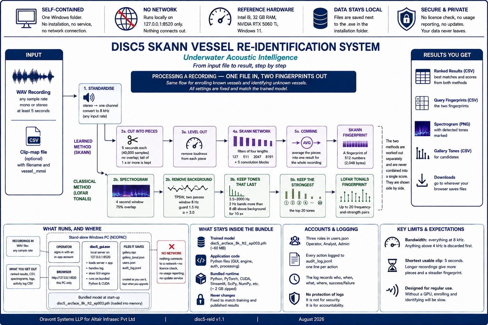
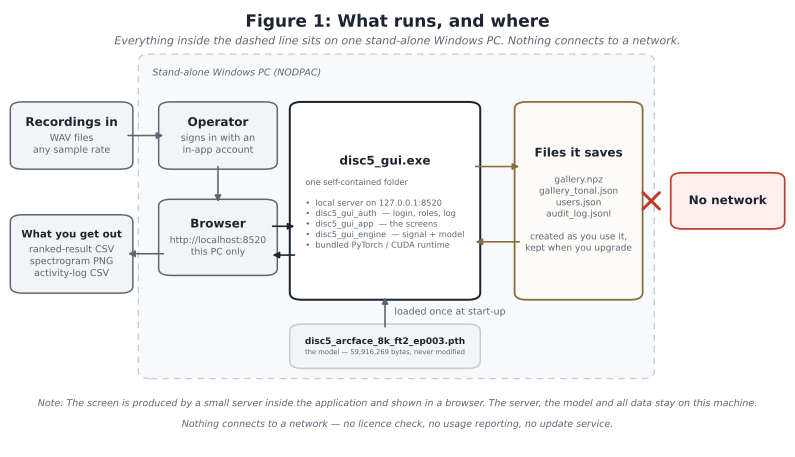
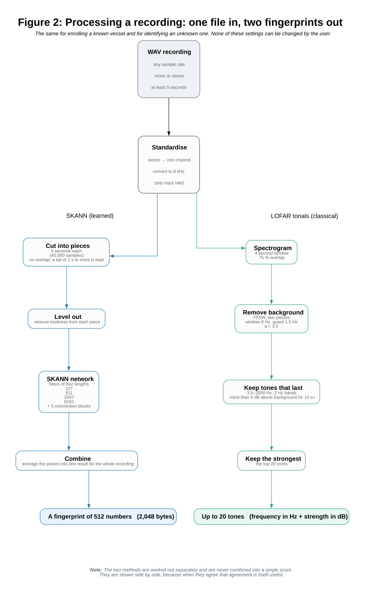
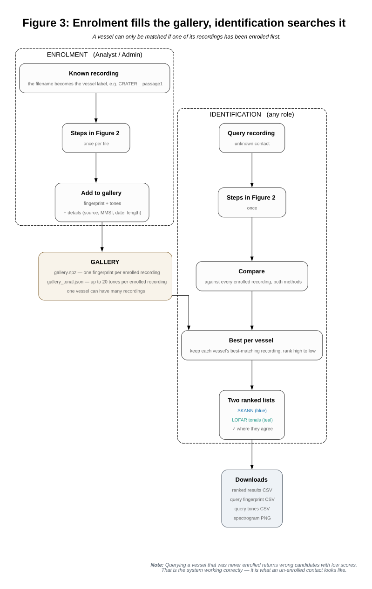

# Re-ID System Flow

## SKANN Vessel Re-Identification — from input file to result, step by step

*Oravont Systems LLP for Altair Infrasec Pvt Ltd · disc5-reid v1.1 · August 2026*

This note follows a recording from the moment it reaches the application to the moment a result comes out, and lists the format and size of every file along the way. Read it alongside the User Manual: the manual explains how to use the application, this note explains what it does inside and where everything is stored. Sections 2 to 4 describe the flow. Sections 5 to 7 are reference tables.

---

## 1. What runs, and where

What we deliver is one self-contained Windows folder. It carries its own Python, its own PyTorch and CUDA libraries, and the trained model. Nothing is installed into Windows, no service is added, and no part of it reaches the network — there is no licence check, no usage reporting and no update service.

The screen you work with is produced by a small web server inside the application, running on the address `127.0.0.1:8520`, and shown in the machine's default browser. That address is only reachable from the same machine — no other computer on any network can open it. This is how the application is built internally; it is not a website and it is not shared over a network. Closing the black console window stops the server and shuts the application down.

**Installation folder.** The bundle unpacks into a folder holding `disc5_gui.exe` and an `_internal\` sub-folder with the runtime, the program files and the model. The zip is about 2 GB; unpacked it is larger, mostly because of the PyTorch and CUDA libraries. The folder must be one the application can write to. If it is installed under `C:\Program Files\`, enrolment appears to work but nothing is saved.

**Reference hardware** (the PC supplied to NODPAC): Intel i9, 32 GB RAM, NVIDIA RTX 5060 Ti, Windows 11. The application will run without a graphics card, but enrolling and identifying then become too slow for regular use. The sidebar shows which one is being used.

---

## 2. Processing a recording — one file in, two fingerprints out

Every recording goes through the same steps, whether you are enrolling a known vessel or identifying an unknown one. There is no separate high-quality path for one and low-quality path for the other. None of the settings below can be changed by the user. They are fixed to match the way the model was trained and tested, and changing any of them would make the scores stop matching our published results without any warning on screen.

### 2.1 Getting the audio into a standard form

The file is read, mixed down to a single channel if it is stereo, and converted to **8 kHz**. Any input sample rate is accepted. The original rate is stored with the recording and shown in the results table, so you can always see what was actually supplied. We work at 8 kHz on purpose: the sound that identifies a vessel sits well below 2 kHz, so throwing away everything above 4 kHz removes data but not information.

A recording shorter than five seconds produces nothing usable and is rejected with a message on screen. It is skipped rather than treated as an error — if you are enrolling many files at once, the rest carry on.

### 2.2 The learned method — SKANN

The 8 kHz audio is cut into **5-second pieces of 40,000 samples** that do not overlap. If at least one second is left over at the end, one more piece is taken from the end of the recording, so the tail is used rather than thrown away. Each piece then has its loudness removed, so that a recording made at a higher gain does not look different from the same vessel recorded quietly.

Each piece goes through the SKANN network: a bank of four filters of different lengths (127, 511, 2047 and 8191 taps, covering roughly 16 milliseconds to 1 second, or 63 Hz down to 1 Hz of detail), whose outputs the network learns how to weigh, followed by five convolutional blocks. Out of this comes a list of **512 numbers**.

The lists from all the pieces are averaged into one, giving a single **512-number fingerprint for the whole recording** — 2,048 bytes. Every fingerprint is scaled to the same length, which is what lets two of them be compared by a simple angle measurement (cosine similarity).

### 2.3 The classical method — LOFAR tonals

At the same time, and completely separately, the same audio is examined for steady narrow tones. The application builds a spectrogram (4-second window, 75 % overlap), removes the broadband background using a **two-pass TPSW estimator** (window 8 Hz, guard 1.5 Hz, α = 3.0), and then keeps only tones that *last*: between 3.5 and 2000 Hz, in 2 Hz bands, a tone must stay more than 8 dB above the background for at least 10 seconds. The strongest **20 tones** are kept, each as a frequency in Hz and a strength in dB.

This is a standard LOFAR analysis, included as an independent second opinion. **The two methods are never combined into one score.** They are worked out separately and shown side by side, because when a fully learned method and a fully traditional method agree, that agreement tells you something a single blended number would hide. (We tested combining them. It made results worse when the contact's speed changed between the two recordings.)

---

## 3. Enrolment — building the gallery

Enrolment takes a recording of a vessel you already know the identity of, runs it through the steps above, and saves the result permanently. Only Analyst and Admin can do this.

You can either point the application at a folder on the machine (no size limit — the easier way when adding many files) or drag and drop files into the browser (limited to 200 MB per file). **The filename, without the `.wav`, becomes the vessel label.** `CRATER__passage1.wav` is stored as `CRATER__passage1`; `rec(7).wav` is stored as `rec(7)`. There is no rename button — to correct a label, delete that entry and enrol the file again.

For each file the application saves two things:

- the 512-number fingerprint, the label and a record of details, added as one row to `gallery.npz`;
- the up-to-20 tones, tied to that same entry, added to `gallery_tonal.json`.

The record of details is filled in automatically with the original filename, the original sample rate, how many 5-second pieces were used, the length of the clip and the date and time of enrolment. Source and MMSI are filled in automatically where the filename or an accompanying clip-map file allows it, and anything you type yourself replaces what was filled in.

**One vessel can have many recordings enrolled.** This is the most useful thing an operator controls. Each extra recording of the same vessel — a different day, a different speed, a different range — widens the range of conditions in which that vessel can later be recognised. Scoring always credits a vessel with its best-matching recording, so extra recordings can only help.

---

## 4. Identification — searching the gallery

Anyone can do this. The unknown recording goes through the same steps, and the result is compared against **every recording in the gallery**:

- **SKANN:** how close the two 512-number fingerprints are.
- **LOFAR tonals:** how much of each recording's tonal energy finds a partner in the other within ±1 Hz, counted both ways round.

Each vessel is then represented by whichever of its recordings matched best, and the vessels are listed from highest score to lowest. Two lists appear side by side, with a ✓ mark where both methods put the same vessel in their top three.

**Enrol first — the most important rule.** The application can only match against what has been enrolled. If you query a vessel that was never enrolled, it will return wrong candidates with low scores. That is the system working correctly, and it is what an unknown, un-enrolled contact is supposed to look like. So a fair test is always: enrol one recording of a vessel, then query a *different* recording of the same vessel.

**What the result is.** Re-ID gives you a shortlist, not an identification. For vessels the model has never been trained on, compared across genuinely different encounters, the correct vessel is the single top answer less than half the time — though it is usually somewhere in the top few. The purpose is to point the analyst at the most likely vessels. Three things tell you how much to trust a result: whether both methods agree (the ✓ mark), how far ahead the top answer is of the second, and how many recordings of that vessel are in the gallery.

---

## 5. Files and formats — the full list

### 5.1 What goes in

| File | Format | Requirements | Typical size |
|---|---|---|---|
| Recording (to enrol or to identify) | WAV | any sample rate; mono or stereo; at least 5 seconds | 1 minute at 8 kHz mono 16-bit ≈ 0.9 MB; at 96 kHz stereo 24-bit ≈ 33 MB |
| Clip-map file (optional) | CSV with `filename` and `vessel_mmsi` columns | placed in the recordings folder or the one above it | under 100 KB |

### 5.2 What the application saves, next to the .exe

| File | Format | What it holds | Size |
|---|---|---|---|
| `gallery.npz` | NumPy archive | one 512-number fingerprint, label and detail record per enrolled recording | about 2.2 KB each; 100 recordings ≈ 250 KB |
| `gallery_tonal.json` | JSON | up to 20 frequency-and-strength pairs per enrolled recording | about 0.6 KB each |
| `users.json` | JSON | account name, role, and the password stored in scrambled form | about 0.3 KB per account |
| `audit_log.jsonl` | Text, one entry per line | one line per action | about 0.2 KB per entry |

These four files are the only ones the application changes while it is being used. Everything else in the folder stays exactly as delivered. So these four are also your complete backup list, and the complete list of what to copy aside and put back when installing a new version.

### 5.3 What is inside the bundle and never changes

| Item | Format | Size | Note |
|---|---|---|---|
| `disc5_arcface_8k_ft2_ep003.pth` | PyTorch model file | 59,916,269 bytes | the delivered model; loaded once when the application starts |
| `disc5_gui_engine.py` | Python | about 19 KB | signal processing, model, gallery, scoring |
| `disc5_gui_app.py` | Python | about 36 KB | the screens |
| `disc5_gui_auth.py` | Python | about 30 KB | login, roles, activity log |
| Bundled runtime | — | about 2 GB zipped | Python, PyTorch, CUDA, Streamlit, SciPy |

The 5-second pieces themselves (40,000 numbers each, 160,000 bytes) exist only in memory while a file is being processed. They are never written to disk.

### 5.4 What comes out, when you ask for it

Downloads go wherever your browser saves files.

| Download | Format | Contents | Who can |
|---|---|---|---|
| Ranked results | CSV | `query_clip`, `native_sr`, `n_segments`, `rank`, `skann_candidate`, `skann_cos`, `tonal_candidate`, `tonal_match` | everyone |
| Query fingerprint | CSV | `query_clip`, `dim`, `value` — 512 rows | everyone |
| Query tones | CSV | `query_clip`, `rank`, `freq_hz`, `strength_db` — up to 20 rows | everyone |
| Spectrogram | PNG | the spectrogram with detected tones marked | everyone |
| Gallery tones | CSV | `candidate`, `passage_key`, `rank`, `freq_hz`, `strength_db` | Analyst, Admin |
| Gallery tones (wide) | CSV | one row per enrolled recording: details plus all 20 tone pairs | Analyst, Admin |
| Gallery fingerprints | CSV | `candidate`, `passage_idx`, `dim`, `value` | Analyst, Admin |
| Activity log | CSV | the recorded actions | Admin |

---

## 6. Accounts and the activity log

Access is controlled by accounts held in `users.json`. There are three roles, each including the one before it: **Operator** (identify, view results and the gallery, download their own query files), **Analyst** (also enrol, delete and download gallery-wide files), and **Admin** (also manage accounts and read the activity log). The first time a new installation is started it asks you to create the first Admin. After that, only an Admin can create accounts — users cannot sign themselves up.

Every action that matters is added to `audit_log.jsonl`, one line per action, recording the time, the user, their role, the Windows account in use, the action, what it was done to, and whether it succeeded. Queries and enrolments also record how many pieces were processed and what the top match was. Sign-ins, failed sign-ins, lockouts, sign-outs and timeouts are all recorded, as are account changes, enrolments, queries, deletions and downloads.

**What this does and does not protect.** It records who did what, and it stops an Operator from deleting the gallery by mistake. It is **not** a security barrier. Anyone who can use that Windows account can open or delete these files directly. On a stand-alone machine, the real protection is physical control of the PC and control of the Windows account. The activity log is deliberately kept in a different file from the accounts, so that if someone resets the accounts, the log shows a gap rather than being wiped with them.

The password rules are set inside the application and can be changed if NODPAC asks: at least eight characters, no requirement to mix letters and symbols, no expiry, five wrong attempts locks the account for five minutes, and a session left idle for twenty minutes is signed out. Because the machine has no internet time source, the clock should be checked when the application is installed — the times in the log are only as good as the clock behind them.

---

## 7. Limits and what to expect

- **Bandwidth.** Everything happens at 8 kHz. Anything above 4 kHz is discarded first.
- **Shortest usable clip.** Five seconds. Longer recordings give more pieces and a steadier fingerprint.
- **Upload limit.** 200 MB per file through the browser. Folder mode has no limit and is the way to add many files.
- **Gallery size.** Comparing against the whole gallery is a single fast calculation. The time a query takes is set by processing the query itself, not by how many vessels are enrolled.
- **Graphics card.** Strongly preferred. Without one everything still works, but slowly.
- **What the model has not seen.** The delivered model has never been trained on NODPAC's own recording equipment. We expect results on that equipment to improve if the model is fine-tuned on NODPAC recordings, but that fine-tuning has not been done and we are not claiming the improvement as a fact.
- **What we compare against.** Where we compare SKANN with a tonal method, the comparison is against *our own automated LOFAR tonal baseline* run on the same clips. We have never measured how accurately a trained analyst identifies the same recordings, and we make no claim against that.

---

*Figure 1 is produced by `disc5_make_flowfig1.py`; Figures 2 and 3 by Graphviz from `F2_fixed.dot` and `F3_fixed.dot`. Every number shown on them is taken from the delivered `disc5_gui_engine.py`, `disc5_gui_app.py` and `run_gui.py`.*
