# Re-ID User Manual

## SKANN Vessel Re-Identification — purpose, technology and operation

**Application version:** v1.2 (sign-in, roles, activity log; sidecar MMSI/IMO auto-fill) · **Model:** `disc5_arcface_8k_ft2_ep003.pth` (frozen) · **Document status:** complete — all screenshots captured and embedded

---

## Contents

**[Part I — What Re-ID is and why it matters](#part-i--what-re-id-is-and-why-it-matters)**  
&nbsp;&nbsp;&nbsp;&nbsp;[1. Purpose](#1-purpose)  
&nbsp;&nbsp;&nbsp;&nbsp;[2. The two methods inside the application](#2-the-two-methods-inside-the-application)  
&nbsp;&nbsp;&nbsp;&nbsp;[3. Why SKANN — the measured case](#3-why-skann--the-measured-case)  
&nbsp;&nbsp;&nbsp;&nbsp;[4. What this means operationally](#4-what-this-means-operationally)  
&nbsp;&nbsp;&nbsp;&nbsp;[5. A brief note on the technology (SKANN)](#5-a-brief-note-on-the-technology-skann)  
**[Part II — Installation and accounts](#part-ii--installation-and-accounts)**  
&nbsp;&nbsp;&nbsp;&nbsp;[6. Requirements](#6-requirements)  
&nbsp;&nbsp;&nbsp;&nbsp;[7. Installation and first run](#7-installation-and-first-run)  
&nbsp;&nbsp;&nbsp;&nbsp;[8. Accounts and roles](#8-accounts-and-roles)  
&nbsp;&nbsp;&nbsp;&nbsp;[9. Onboarding users (Admin)](#9-onboarding-users-admin)  
**[Part III — Operating the application](#part-iii--operating-the-application)**  
&nbsp;&nbsp;&nbsp;&nbsp;[10. Enrolling vessels (Analyst)](#10-enrolling-vessels-analyst)  
&nbsp;&nbsp;&nbsp;&nbsp;[11. Identifying a recording (all roles)](#11-identifying-a-recording-all-roles)  
&nbsp;&nbsp;&nbsp;&nbsp;[12. Reading the results](#12-reading-the-results)  
&nbsp;&nbsp;&nbsp;&nbsp;[12a. Worked example — a contact at changed speed](#12a-worked-example--a-contact-at-changed-speed)  
&nbsp;&nbsp;&nbsp;&nbsp;[13. Exports](#13-exports)  
&nbsp;&nbsp;&nbsp;&nbsp;[14. The Gallery tab](#14-the-gallery-tab)  
&nbsp;&nbsp;&nbsp;&nbsp;[15. The activity log (Admin)](#15-the-activity-log-admin)  
&nbsp;&nbsp;&nbsp;&nbsp;[16. Upgrading to a new version](#16-upgrading-to-a-new-version)  
&nbsp;&nbsp;&nbsp;&nbsp;[17. Troubleshooting](#17-troubleshooting)  
**[Appendix](#appendix)**  
&nbsp;&nbsp;&nbsp;&nbsp;[Fixed signal settings](#fixed-signal-settings)  
&nbsp;&nbsp;&nbsp;&nbsp;[Honest-use notes for demonstrations](#honest-use-notes-for-demonstrations)  
&nbsp;&nbsp;&nbsp;&nbsp;[Screenshot capture checklist](#screenshot-capture-checklist)

---

## Part I — What Re-ID is and why it matters


This part answers one question: what does the Re-ID application do that is not being done today? It describes the operational purpose (§1), the two independent methods the application runs (§2), the measured case for the new method on NODPAC's own demonstration clips (§3), what changes for the operator, the analyst and the unit (§4), and a brief account of the technology (§5). Parts II and III then cover installation and operation step by step. Companion document: *DISC5 Re-ID System Flow* covers what happens inside, file by file.

### 1. Purpose

Re-ID answers one operational question: **"Which known vessel does this recording sound like?"** An operator loads a passive-sonar recording (a WAV file), and the application returns a ranked list of candidate vessels from a gallery of previously enrolled recordings, each with a similarity score.

Today that question is answered by an analyst reading LOFAR displays: locating narrowband tonal lines, comparing their frequencies against remembered or recorded line sets, and judging a match. That skill is real and remains valuable — but it is slow, depends on the individual analyst, and degrades under exactly the conditions of operational interest: sea-state noise and closing/opening targets whose tonals are Doppler-shifted.

Re-ID automates the comparison step. It does not replace the analyst's judgement about what to do with a match; it replaces the minutes-to-hours of manual line comparison with a ranked shortlist produced in seconds, consistently, from any operator.

### 2. The two methods inside the application

Re-ID deliberately runs **two independent methods side by side** on every query, because they fail differently and agreement between them is itself information.

**LOFAR-tonal (the familiar method, automated).** The application extracts up to 20 narrowband tonal lines from the recording using a TPSW whitener — the same physics the analyst reads by eye — and scores candidates by how well line frequencies match. This column behaves the way an analyst expects a line-matching method to behave, including its weaknesses.

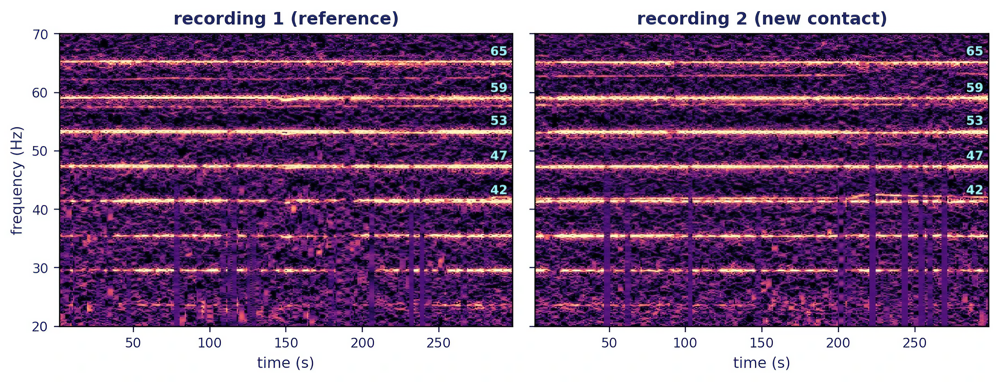
*Figure 1: Two passages of the same vessel, tonal lines labelled — what the tonal method compares.*

**SKANN (the new method).** A deep neural network reads the raw waveform and produces a 512-dimensional acoustic **fingerprint** of the vessel — a compact numerical signature capturing the full character of the radiated sound (harmonic structure, broadband texture, modulation), not just line positions. Two recordings are compared by the cosine similarity of their fingerprints.

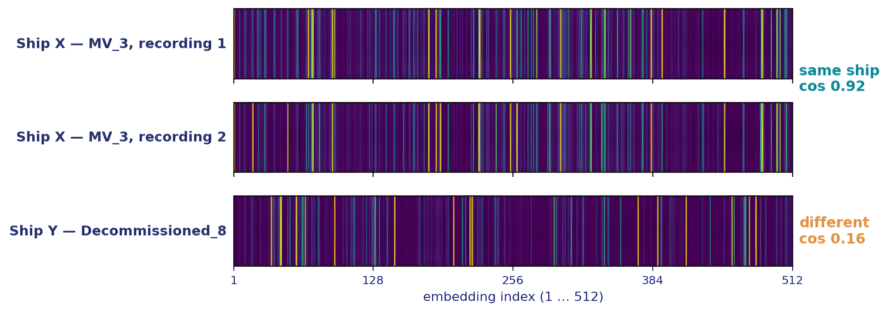
*Figure 2: Waveform → network → 512-dimensional fingerprint — the enrol/query concept.*

The two columns are never numerically fused. (We tested combining them into one score. It made results worse when the contact's speed changed between the two recordings.) When both methods rank the same vessel in the top 3, the app tags the agreement — that convergence of two unrelated mechanisms is the strongest single indicator the application offers.

### 3. Why SKANN — the measured case

On NODPAC's own 21 demonstration clips, scored under identical conditions, SKANN outperformed the automated LOFAR-tonal baseline **under every condition** — and the gap widens precisely where the tonal method is weakest:

| Condition | SKANN rank-1 | Automated tonal rank-1 |
|---|---|---|
| Clean | **1.000** | 0.857 |
| + Sea-state noise | **0.714** | 0.619 |
| + Speed change (±4%, Doppler) | **0.810** | 0.238 |
| + Noise and speed together | **0.524** | 0.095 |

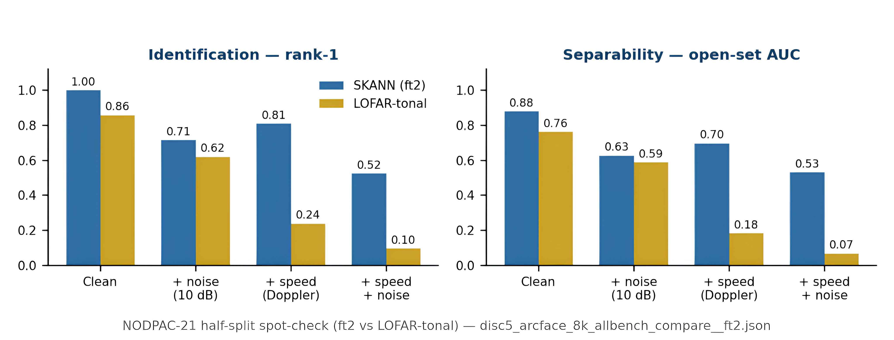
*Figure 3: The table above as bars, with open-set AUC alongside under the same conditions.*
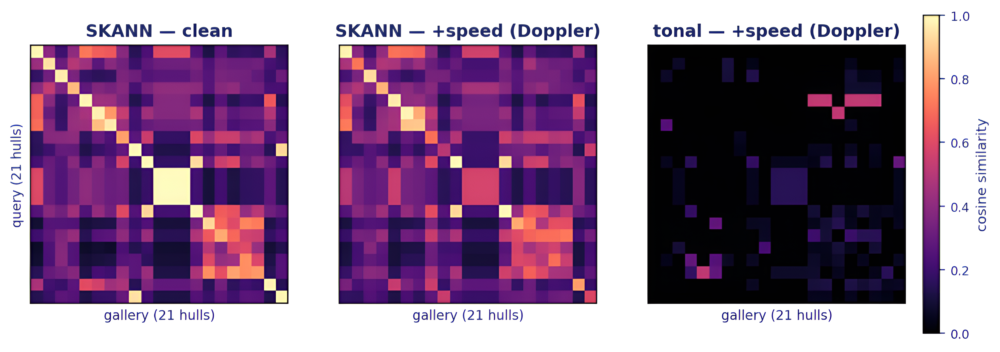
*Figure 4: Similarity matrix on the 21 clips — bright diagonal = correct matches.*

Read the pattern, not just the numbers. A ±4% speed change shifts every tonal line by ±4% of its frequency — enough to break frequency matching almost completely (0.238, and 0.095 with noise on top). The SKANN fingerprint, trained to be invariant to exactly these disturbances, retains most of its accuracy. **A closing or opening contact in weather is the realistic case, and it is where the margin is largest.**

One honest boundary on this claim: the comparator is our **automated** tonal baseline running on the same clips — not the accuracy of a NODPAC analyst working a full workstation, which has never been measured. This should be stated up front in any demonstration.

### 4. What this means operationally

For the **operator**, Re-ID turns a specialist comparison task into a load-file-read-list task: a query takes seconds, needs no line-reading skill, and produces the same answer regardless of who runs it. For the **analyst**, it is a force multiplier and a second opinion — the shortlist arrives pre-ranked with both methods' views and the full evidence (scores and the tonal-line record, exportable as CSV) one click away, leaving the analyst's time for the judgement calls the machine cannot make: whether a 0.68 against a three-passage gallery entry in heavy weather is a call to escalate. For the **unit**, the gallery itself becomes an asset: every enrolled passage compounds, building an acoustic reference library that survives postings and shift changes.

The model is **frozen** — it never retrains in the field, so its behaviour is fixed, testable and certifiable. What grows is the **gallery**. And because the model has never been trained on NODPAC's own recording chain, performance on NODPAC data is expected to improve further if the model is ever fine-tuned on it — an option, not a requirement, and gated by a formal evaluation.

### 5. A brief note on the technology (SKANN)

SKANN is a raw-waveform convolutional neural network (~4.6 M parameters) purpose-built for ship-radiated noise — there is no fixed spectrogram front end; the network learns its own time–frequency analysis. Audio is resampled to 8 kHz mono, cut into 5-second segments and z-normalised, then processed in three stages:

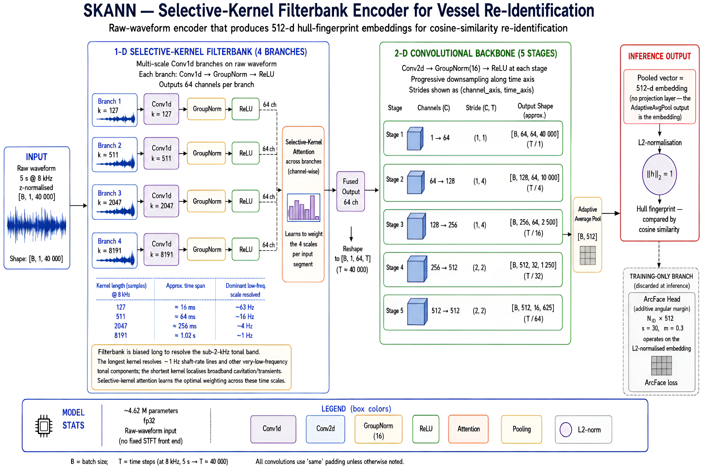
*Figure 5: Model structure — SK filterbank → selective-kernel fusion → 2-D encoder → 512-d fingerprint.*

**SK Filterbank.** Four parallel banks of learned filters run over the raw waveform at kernel lengths of 127 / 511 / 2,047 / 8,191 samples — at 8 kHz, analysis windows from ~16 ms to ~1 second. Short kernels localise broadband transients and cavitation in time; the longest kernels resolve frequency to ~1 Hz, sharp enough for slow shaft-rate lines. A **selective-kernel attention** stage then learns, per segment, how to weight and fuse the four scales — the network decides what matters in each recording rather than having frequency bands hand-assigned.

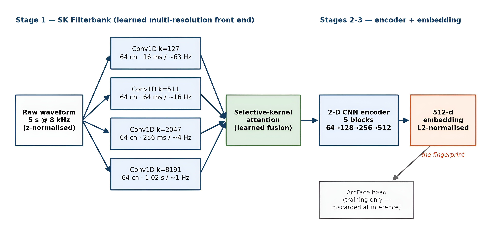
*Figure 6: The same chain as a labelled schematic — kernel lengths, resolutions, and the training-only ArcFace head.*

**Convolutional encoder.** The fused feature map is treated as a learned time–frequency image and passed through a five-block 2-D convolutional encoder, pooled to a single vector, projected to a **512-dimensional embedding** and normalised to unit length. That normalised vector *is* the fingerprint; a recording's fingerprint is the mean of its segment embeddings, re-normalised. Unit normalisation is what makes cosine similarity the correct comparison.

**Training.** The network was trained with an **ArcFace** angular-margin objective over hundreds of vessel identities drawn from multiple ocean datasets and recording systems, with heavy augmentation — added sea-state noise and speed perturbation among five transforms — so that recordings of the *same* hull cluster tightly on the unit hypersphere while *different* hulls are pushed apart by a margin, regardless of recording conditions. That trained invariance is what the condition table in §3 measures. The ArcFace classification head exists **only during training**; at inference it is discarded and only the embedding backbone ships. The fielded model is therefore a fixed function from audio to fingerprint with no vessel list baked in — the vessel list is the gallery, and the gallery is yours.

Full training details — datasets, augmentation design, epoch-set construction, checkpoint lineage and evaluation protocol — are in `DISC5_SKANN_Technical_Documentation` (the technical companion to this manual).

---

## Part II — Installation and accounts

### 6. Requirements

**The machine.** Windows 10/11 x64, an NVIDIA GPU (the application runs on CPU but embedding is impractically slow — minutes per segment; the sidebar must read `Compute: GPU`), ~6 GB free disk for the installed bundle, and a **writable** installation folder (not `C:\Program Files\`). The reference configuration is the supplied NODPAC PC: Intel i9, 32 GB RAM, NVIDIA RTX 5060 Ti, Windows 11. The **only system prerequisite is a current NVIDIA graphics driver** — verify with `nvidia-smi` in PowerShell, which must print a table naming the card. No Python, no internet, and no other software is required — the bundle is self-contained, including the CUDA libraries (cu130 build, carrying the Blackwell kernels the RTX 50-series needs) and VC++ runtime DLLs.

**Input files.** WAV format only. Any sample rate (the application resamples to 8 kHz internally); mono or stereo (stereo is mixed down automatically); any bit depth soundfile can read (16/24/32-bit PCM or float). Minimum usable length is ~5 seconds after resampling — shorter clips are rejected with a message. There is no upper length limit, but the browser upload control caps single files at 200 MB; for large files or bulk enrolment, use the **folder** mode (§10), which reads directly from disk with no size cap.

**The clock.** Activity-log timestamps come from the machine's own clock. An air-gapped PC has no time synchronisation — verify the system date and time at installation and periodically after.

### 7. Installation and first run

1. Obtain `Re-ID.zip` from the v1.2 release page of the `disc5-reid` repository — [https://github.com/suniltyagialtair/disc5-reid/releases/tag/v1.2](https://github.com/suniltyagialtair/disc5-reid/releases/tag/v1.2) (access is by repository invitation) — and verify its integrity: `CertUtil -hashfile Re-ID.zip SHA256` must match the value in `SHA256SUMS.txt` published alongside it.
2. Extract to a writable folder, e.g. `C:\DISC5\Re-ID\`. The folder then contains `disc5_gui.exe` and `_internal\`.
3. Run `disc5_gui.exe`. If Windows shows a blue "Windows protected your PC" (SmartScreen) message, click **More info → Run anyway** — expected for an in-house, unsigned application on an offline machine; if antivirus quarantines files, add the Re-ID folder to its exclusions and re-extract. A console window opens and the interface opens in the browser at `localhost:8520` (if the browser does not open by itself, type the address the console prints). The interface is reachable **only from this machine**, by design. **Keep the console window open the whole session — closing it is also how you shut the application down at the end.**
4. **First-run setup.** On a fresh installation the application asks you to create the first **Admin** account before anything else.


*Screenshot 01: first-run setup — creating the first Admin account.*

Choose the Admin username and a password of at least 8 characters. This account governs all others; record the credentials per your unit's procedure. If the Admin password is ever lost, recovery is possible — see the *Re-ID Administrator Security Note*.

**First demonstration (recommended).** `DISC5_demo_clips_v2.zip` (~0.6 GB) is attached to this release — [https://github.com/suniltyagialtair/disc5-reid/releases/tag/v1.2](https://github.com/suniltyagialtair/disc5-reid/releases/tag/v1.2) — a demonstration set of 24 vessels: a *gallery* folder (one reference recording per vessel, with the metadata sidecar) and a *query* folder (two later passages per vessel). After creating accounts, extract it (e.g. `C:\DISC5\demo_clips\`), enrol the gallery folder from the Enrol tab's folder mode (§10) — MMSI and IMO fill in automatically from the sidecar — then identify recordings from the query folder (§11). The correct vessel should appear at or near the top of the SKANN column, usually with the ✓ agreement tag. This walks the entire workflow end-to-end — and it teaches the enrolment-first protocol on clips where the right answer is known. Treat it as a workflow demonstration, not a measure of accuracy on your own recordings.

### 8. Accounts and roles

Sign-in is required for every session. Three roles, strictly nested — each includes everything below it:

| Role | Can additionally |
|---|---|
| **Operator** | Identify recordings, view ranked results, read the Gallery tab, export query-scoped CSVs |
| **Analyst** | Enrol recordings; delete passages or vessels; clear the gallery; gallery-wide exports |
| **Admin** | Manage user accounts (Users tab); view and export the activity log (Activity tab) |

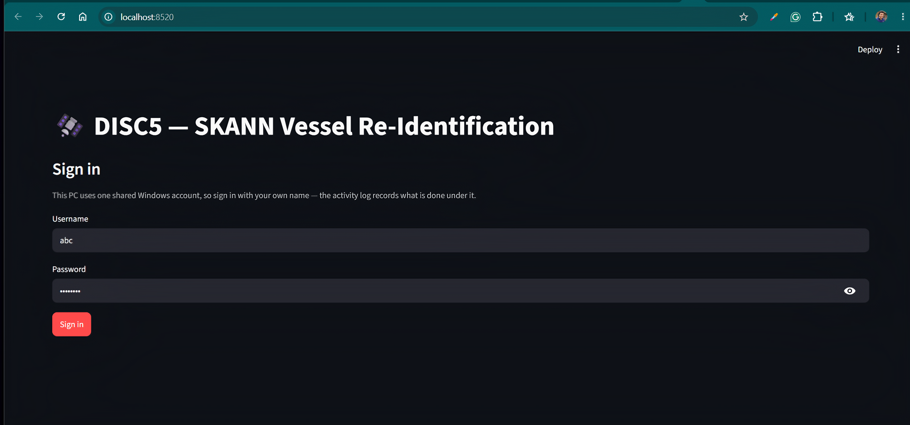
*Screenshot 02: the sign-in screen.*

**What the sign-in is for.** The sign-in puts a name against every action and keeps destructive functions away from accidental use by restricting them to Analysts. Passwords are stored hashed, so no user — including the Admin — can read another's password. The security model, its limits, and credential recovery are covered in the *Re-ID Administrator Security Note*, which the administrator should hold.

### 9. Onboarding users (Admin)

1. Sign in as Admin (§8).
2. Open the **Users** tab.
3. Under **Add a user**: username (use people's names, not role words — the activity log records the username), role, and an initial password. The new user is required to set their **own** password at first sign-in, so the initial password is a one-time handover secret.
4. The same tab manages existing accounts: change role, disable/enable, delete, reset password (which again forces a change at next sign-in).


*Screenshot 03: the Users tab — accounts table and the "Add a user" form.*


*Screenshot 04: managing an existing user — here the Admin is changing 'ghi' from Operator to Analyst; disable, delete and password-reset controls alongside.*

The application refuses to demote, disable or delete the **last enabled Admin** — user administration can never be locked out by accident. Sessions end after 20 minutes of inactivity; five consecutive failed sign-ins lock an account for 5 minutes (both events are logged).

**Password policy (stated defaults):** minimum 8 characters; no complexity rules; no expiry. Complexity and expiry requirements, if mandated later, are configuration changes, not redesigns. The reasoning behind these defaults is in the *Re-ID Administrator Security Note*.

---

## Part III — Operating the application

### 10. Enrolling vessels (Analyst)

Enrolment is how the gallery — the reference library every query is compared against — is built. Each enrolled recording becomes one **passage**: its 512-d SKANN fingerprint plus its top-20 tonal lines, stored under the recording's filename. A vessel may (and should) hold several passages: **enrolling multiple passages per vessel is the single biggest lever on recall**, because a query scores against every passage and reports the best per vessel.

1. Open the **➕ Enrol vessel** tab.
2. Optionally set metadata — source, MMSI, IMO. Left blank, source is auto-detected from the filename prefix (`ONC_`, `IARA_`, `DC_`/`NODPAC_`, `SHIPSEAR_`) and MMSI and IMO from a `*clip_map.csv` sidecar if present (columns `vessel_mmsi`/`mmsi` and `vessel_imo`/`imo`); anything typed overrides.
3. Choose the input mode: **Load from a folder** (path on this machine; no file-size limit; best for bulk) or **Upload files** (drag-and-drop; 200 MB/file cap). Select the recordings and press **Enrol**.
4. Each recording is processed in turn — progress is shown; too-short clips are skipped with a message, not fatal.


*Screenshot 05: the Enrol tab — a single recording uploaded, ready to enrol under its filename.*

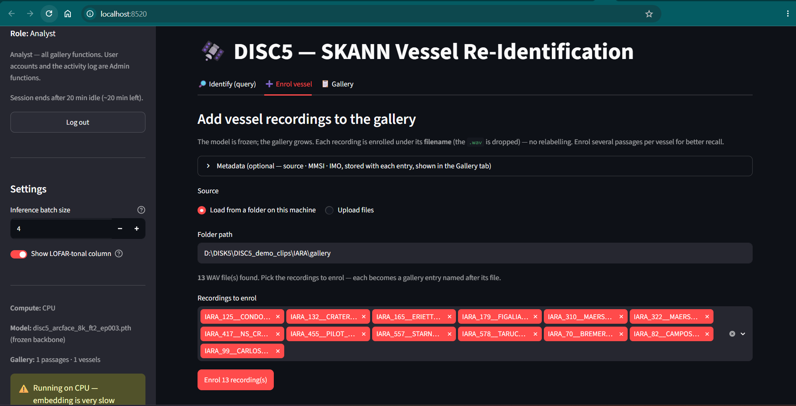
*Screenshot 05b: folder mode — 13 demo recordings selected for one enrolment run.*

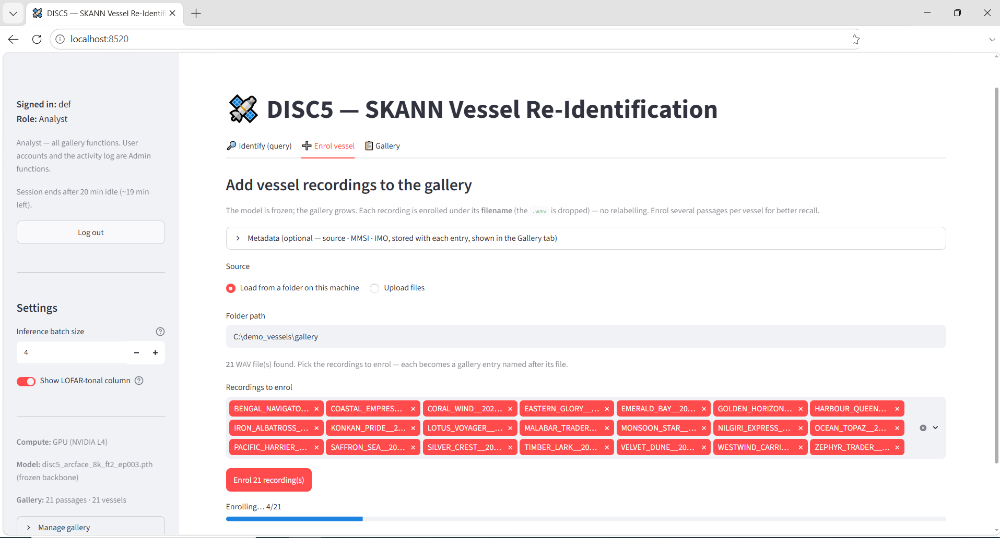
*Screenshot 06: bulk enrolment in progress — 21 recordings selected from folder mode, 4 of 21 processed.*

> Vessel names, dates, MMSI and IMO numbers appearing in Screenshots 06–11 are illustrative demonstration data, not real vessels. The demonstration set — including its changed-speed queries (Screenshot 08) — is prepared demonstration material for walking the workflow.

Naming matters: the filename becomes the gallery label (the `.wav` extension is dropped). `CRATER__passage1.wav` is a useful label; `rec(7).wav` is not. There is no relabelling — delete and re-enrol to rename. Good practice: enrol clean, representative passages, several per vessel. Mixing sources in one gallery (NODPAC, IARA, ONC together) is fine — but a sparse or very different-sounding gallery can make the top rank look more confident than it is.

### 11. Identifying a recording (all roles)

1. Open the **🔎 Identify (query)** tab, upload the query WAV, choose how many candidates to display, press **Identify**.

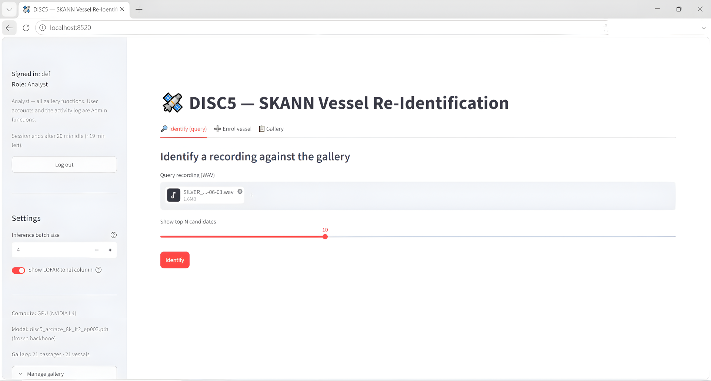
*Screenshot 07: the Identify tab — query recording loaded, top-N set to 10, ready to identify against the demonstration gallery.*
2. Embedding takes seconds on GPU. The result is two ranked lists side by side — SKANN (blue) and LOFAR-tonal (teal).

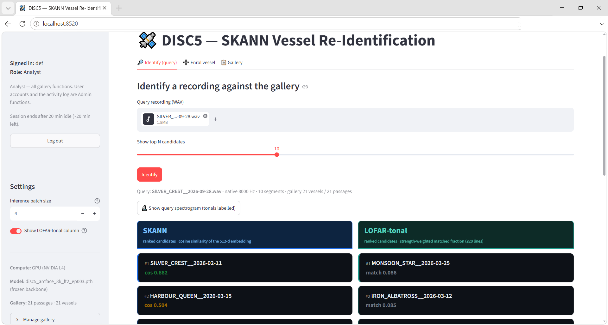
*Screenshot 08: ranked results — a changed-speed repeat query of an enrolled vessel against the demonstration gallery. SKANN: rank 1 correct at cosine 0.882, with rank 2 far behind at 0.504. LOFAR-tonal: the correct passage scores 0.000 (rank 17); the column's best is a wrong vessel at 0.086. §12a walks through this result.*

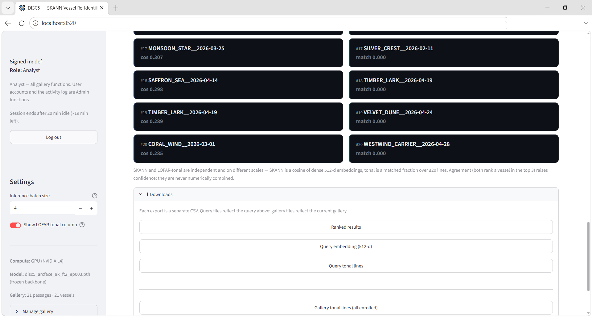
*Screenshot 08b: the same result scrolled to the tail of the lists — the correct passage sitting at rank 17 in the tonal column at match 0.000 — and the Downloads panel beneath, where the ranked results, the query fingerprint and the tonal-line CSVs are exported.*

**The enrolment-first protocol — the single most important operating rule.** The application can only match against what is enrolled. Querying a vessel that is **not** in the gallery correctly returns low-scoring wrong candidates — that is the system working, not failing. A meaningful test of the system is: enrol one recording of a vessel, then query a **different** recording of the same vessel. Likewise in operations: a flat, low-scoring result is the expected signature of an out-of-gallery contact.

### 12. Reading the results

Each candidate card shows rank, vessel label and score. The colour is a rough display band, **not a decision rule**:

| | Green | Amber | Grey |
|---|---|---|---|
| SKANN cosine | ≥ 0.65 | 0.45–0.65 | < 0.45 |
| Tonal match | ≥ 0.35 | 0.15–0.35 | < 0.15 |

The two scales are **not comparable to each other** — SKANN is a cosine over dense fingerprints, tonal is a strength-weighted matched fraction over ≤ 20 lines. Compare each column against its own ranking. What to weigh, in order: **agreement** (both methods top-3 on the same vessel — the strongest indicator, tagged ✓); **margin** (a rank-1 well clear of rank-2 means more than its absolute value); **conditions** (in noise or with a manoeuvring contact, expect lower absolute scores — §3 — and lean harder on agreement and margin); and **gallery depth** (a match against a three-passage vessel is worth more than against a single passage).

**Re-ID is a shortlisting aid, not an automatic identification.** On unseen vessels across genuinely different encounters, the correct vessel is the single top match less than half the time — but is usually within the top few. Review the shortlist rather than acting on rank 1 alone, and confirm with the tonal second opinion, the tones CSVs, and your own analysis.

**Evaluating the tonals — use the CSVs.** The way to verify the tonal evidence line by line is to download the **Query tones CSV** (§13; the Downloads panel in Screenshot 08b): up to 20 detected lines with their frequency in Hz and strength in dB — the exact lines the tonal score uses. An Analyst can additionally download the candidate's **Gallery tones CSV** and compare the two frequency lists directly; matching lines within a few Hz are the tonal method's evidence for the match. (The spectrogram view is disabled in this version; its button points to these same CSV downloads.)

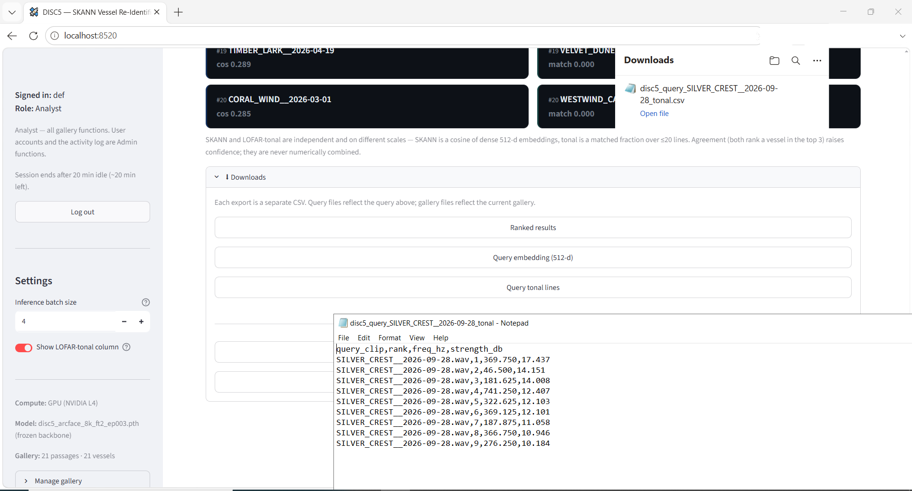
*Screenshot 09: the downloaded Query tones CSV opened for inspection — one row per detected line, strongest first. This particular query is the changed-speed passage of Screenshot 08: comparing its frequencies against the vessel's enrolled lines shows every line displaced by a common factor — the CSV diagnosing the speed change that broke the tonal score.*

### 12a. Worked example — a contact at changed speed

The condition table in §3 predicts that a speed change breaks tonal matching while SKANN holds. Screenshot 08 (§11) is exactly such a query, live from the demonstration set: a repeat passage of the same vessel at a changed speed. SKANN: rank 1 correct at cosine 0.882 — versus 0.891 on the vessel's steady-speed passage, a loss of 0.009. LOFAR-tonal: the correct passage falls from 0.328 on the clean run to 0.000 (rank 17), with a wrong vessel topping the column at 0.086 — one speed change took it to zero, exactly the §3 mechanism.

A flat, near-zero tonal column under a manoeuvring contact is therefore **expected behaviour**, not a fault — read the SKANN column and the margin, and use the tones CSV (Screenshot 09) to confirm the uniform frequency shift that explains the tonal collapse.

### 13. Exports

Downloads go wherever your browser saves files. Every export is logged.

| Download | Format | Contents | Who can |
|---|---|---|---|
| Ranked results | CSV | `query_clip`, `native_sr`, `n_segments`, `rank`, `skann_candidate`, `skann_cos`, `tonal_candidate`, `tonal_match` | everyone |
| Query fingerprint | CSV | `query_clip`, `dim`, `value` — 512 rows | everyone |
| Query tones | CSV | `query_clip`, `rank`, `freq_hz`, `strength_db` — up to 20 rows | everyone |
| Gallery tones | CSV | `candidate`, `passage_key`, `rank`, `freq_hz`, `strength_db` | Analyst |
| Gallery tones (wide) | CSV | one row per enrolled recording: details plus all 20 tone pairs | Analyst |
| Gallery fingerprints | CSV | `candidate`, `passage_idx`, `dim`, `value` | Analyst |
| Activity log | CSV | the recorded actions | Admin |

### 14. The Gallery tab

Read-only for Operators: every enrolled passage with its vessel, source, MMSI/IMO, clip length, sample rate, line count and top frequencies — the reference for interpreting a result.

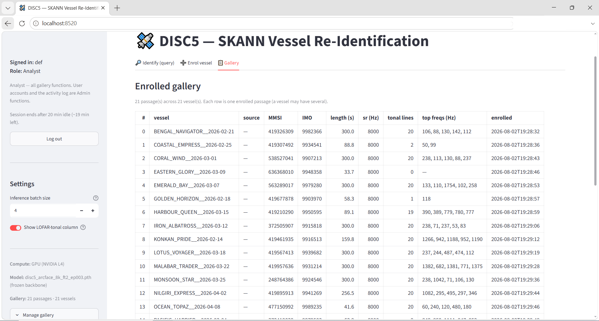
*Screenshot 10: the Gallery tab — one enrolled passage per vessel, MMSI and IMO auto-filled from the sidecar file. Note the vessel with 0 detected tonal lines (a quiet 33.7 s clip): SKANN enrols and matches it even where the tonal comparator has nothing to work with.*

Analysts additionally: delete any single passage (removed from both stores together), remove a whole vessel or clear the gallery (sidebar → Manage gallery), and the wide CSV exports.

Gallery size does not slow queries down: comparing a query against the whole gallery is a single fast calculation, so the time a query takes is set by processing the query itself, not by how many vessels are enrolled.

### 15. The activity log (Admin)

Everything of consequence is recorded: sign-ins (including failures and lockouts), account changes, enrolments, deletions, queries (with segment count and top match), exports, sign-outs and session timeouts.

**In the application:** the **📊 Activity** tab shows the most recent events newest-first, filterable by user and action, exportable as CSV.


*Screenshot 11: the Activity tab with a filter applied.*

**On disk:** `audit_log.jsonl` beside the executable — append-only, one JSON object per line:

```
{"action":"query","host_account":"Admin","object":"DC_D9_S3.wav","outcome":"ok",
 "role":"Operator","ts":"2026-07-28T16:09:44","user":"Operator1","n_seg":12,"top_match":"DC_D9_S1"}
```

Reading it: `ts` local machine time; `user`/`role` the signed-in identity; `action`/`object` what was done to what; `outcome` `ok` or a failure reason (`fail_password`, `fail_no_user`, `lockout`); trailing fields per-action detail. `host_account` is the Windows account — on a shared-login machine it is constant and carries no information; the `user` field is the accountable identity.


### 16. Upgrading to a new version

Before extracting a new `Re-ID.zip` over an existing installation, **preserve the four state files** beside `disc5_gui.exe`: `users.json` (accounts), `audit_log.jsonl` (activity history), `gallery.npz` (fingerprints), `gallery_tonal.json` (tonal lines). Copy them aside, extract the new bundle, copy them back. Skipping this loses every account and every enrolled vessel. Verify the new zip's SHA-256 against its `SHA256SUMS.txt` before extracting.

### 17. Troubleshooting

| Symptom | Cause and remedy |
|---|---|
| Sidebar shows `Compute: CPU` | Graphics driver not active. Run `nvidia-smi`; if it fails, install a current NVIDIA driver and reboot, then relaunch |
| Windows blocked the app ("protected your PC") | SmartScreen on an unsigned in-house app: **More info → Run anyway**; add the folder to antivirus exclusions if files were removed |
| Browser did not open by itself | Open a browser manually at the address the console window prints (e.g. `http://localhost:8520`) |
| Enrolment "succeeds" but the gallery stays empty | Installation folder is not writable — move out of `C:\Program Files\` |
| "Query too short" | Clip under ~5 s after resampling to 8 kHz |
| Upload rejected at 200 MB | Browser-upload cap; use folder mode (§10) |
| Account locked | 5 failed sign-ins → 5-minute lockout; wait, or an Admin resets the password |
| Admin password lost | Recoverable — see the *Re-ID Administrator Security Note* (gallery and activity log are unaffected) |
| App unreachable from another machine | By design — the interface binds to `localhost` only |

---

## Appendix

### Fixed signal settings

8 kHz mono; 5 s / 40,000-sample segments; per-segment z-normalisation; TPSW tonal whitener (window 8 Hz, guard 1.5 Hz, α 3.0); a tone is detected only if it holds more than 8 dB above the background for at least 10 seconds, between 3.5 and 2000 Hz; ≤ 20 tonal lines per recording; 512-d L2-normalised embeddings, mean-pooled per recording. These mirror the training pipeline exactly and are not operator-adjustable — changing them would silently desynchronise scores from the validated benchmarks.

### Honest-use notes for demonstrations

State the comparator precisely: SKANN outperformed **our automated LOFAR-tonal baseline** on NODPAC's own 21 clips under every condition — not "NODPAC's method"; analyst-in-the-loop accuracy has never been measured. Describe fine-tuning on NODPAC data as **"expected to improve further"**, never as a guarantee. Brief the enrolment-first protocol (§11) before any hands-on session — un-briefed testing of un-enrolled vessels is the known path to a false "it returned the wrong ship" impression.

### Screenshot capture checklist

Screenshots 01–11 are embedded above (08/08b = the changed-speed query demonstration and its scrolled tail; 09 = its Query tones CSV opened for inspection). 01–05b and 11 were captured on the local build (Chrome); 06–10 on the packaged GPU build (Edge), at 100% browser zoom, full window, with browser account and assistant buttons painted out of the toolbar. Screenshots 06–10 use illustrative demonstration vessel data throughout. For future captures: 100% zoom, full window, packaged app (not dev mode); use test vessel names, not operational ones, for any copy that leaves the site.
